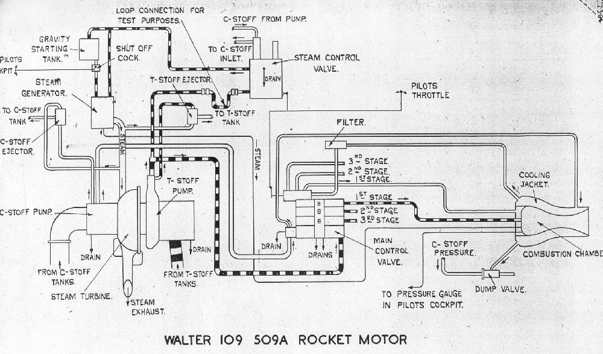

### 联盟衰退

　　激增的经费提高了项目在军械局内的地位。1936年夏天，火箭团队升格为多恩伯格领导下的独立处室。火箭处历经多次改名，又经历了1938年测试部重组为研发测试部，最终得到代号：军械局测试部11处（Wa Prüf 11）。

　　多恩伯格升任处长，理所当然地成为固体和液体燃料火箭项目的主管。早年，他对项目的贡献很大；1935年，在贝克尔兼任柏林技术大学新成立的军事技术系主任后，他获授荣誉博士。1934年末到1936年初，多恩伯格离开并加入现役，在这之前,他一直排在冯•霍斯蒂希和施耐德之后，而现在他们都离开火箭项目到其他岗位任职。多恩伯格始终微笑和善、能言善辩，是销售大师、游刃有余的官僚体制适应者、专业领域中有天赋的工程师。他成为了在库默斯多夫和佩内明德火箭核心团队中有威望的领导者。因为非正式场合穿毛短袖（Aipine lederhosen）的习惯，他获得了巴伐利亚的传统昵称“Seppl”。他坐镇柏林，确保火箭团队不受干扰。尽管极端忠诚于贝克尔和军械局，他并没有伪造文书或者游离于命令限制之外来避开陆军官僚们设下的障碍。

　　多恩伯格的技术拍档是布劳恩，这个年轻人拥有巨大的亲和力、老练、聪明、领导能力出众，更不用说其社会地位和无瑕疵的态度。他的下属和熟人都曾提到，他具有号召力的品格快速地克服了年龄带来的怀疑。唯一令多恩伯格不满的是，布劳恩总是有太多的灵感和爱好，不能专心于本职。这没有阻止军械局提拔这位25岁的贵族青年，1937年，佩内明德实验中心启用，布劳恩成为“东部工作区”负责人，手下有123名科研人员和226名工人。

　　在空军的管理下，佩内明德建设得非常迅速，刚过一年，库默斯多夫的大部分工作就都可以移到佩内明德完成了。中心设立了司令部办公室，由陆军少将领衔，统一管理空军的“西部工作区”和陆军的“东部工作区”，这体现了中心的跨军种特性。佩内明德西在岛的西北角，方圆十平方公里，基地给实验性的飞机配备了一个机场，还有机库和一些管理性建筑，西区一直保持了适度的规模。这一点和陆军不一样，因为佩内明德西并不是设计来当研发中心。在其西南部，佩内明德的村庄中有一个液氧制造厂和新建的港口。佩内明德东是个狭长型地块，从岛的北端沿着波罗的海海岸一直延伸到已被接管的卡尔斯哈根（Karlshagen）小型海滩度假村。卡尔斯哈根的北边是居住区，有漂亮尖顶的排屋和公寓给两军工作人员使用。居住区与其他地区通过当地的铁路连接，使用了老旧淘汰的机车。北边稍远的地方是佩内明德东的管理区、实验室和车间。这里有总部大楼（“House 4”），亚瑟•鲁道夫领导的制造车间，以及其他主要部门的办公楼，包括瓦尔特•里德尔的设计办公室，1937年秋由工程硕士（diploma engineer）Gerhard Reisig组建的测量团队。所有设施都建设得宽敞舒适，保留了尽量多的树木作为伪装。

　　出于安全以及保密的考虑，更北区域保留作为建设测试架用地，初始设计中最大的是1号架，用来试车大型火箭引擎。与车间设施的布局类似，火箭团队想得很远。这个支架并不仅仅着眼A-4的25吨引擎，其测试上限达到了100吨，可以供下一步更大型的导弹使用。测试支架将到1938-39年才能完工，瓦尔特•蒂尔（Walter Thiel）博士领导的推进团队不得不留在库默斯多夫。1934年，在库尔特•瓦姆克博士因事故身亡后，蒂尔接替了他在舒曼的研发处的位置，蒂尔是个有天赋但很情绪化的化学工程师。1936年，蒂尔被调至多恩伯格麾下，从事25吨引擎的研发。1940年夏天前，他的团队一直待在库默斯多夫，在此期间，他频繁前往佩内明德，特别是1号测试支架于1939年春投入使用之后。

　　蒂尔滞留西试验中心的同时，克劳斯•里德尔成立了测试架团队，他是火箭发射场的骨干，后来在柏林为西门子工作。他来佩内明德的方式很独特。1936年，内贝尔再一次找上了军械局，这次他以被迫害和忽视的发明家身份出现，并争取到了纳粹党工程技术组织负责人、高速公路建设者弗里茨•托特（Fritz Todt）博士的支持。而且内贝尔和里德尔一起，终于拿到了火箭发射场引擎的研发专利。为了打发内贝尔，陆军同意支付七万五千马克的专利费。作为1937年协定的一部分，内贝尔必须宣誓保守技术秘密并不再从事相关研发工作，但这些限制不针对里德尔，因为布劳恩希望招募他的老朋友加入佩内明德。里德尔带来了三个西门子同事，都是火箭发射场的老伙计。

　　佩内明德的建设如火如荼，人员招募也在进行，两军合作的火箭飞机项目仍然是联盟的支柱。这个项目也是空军赞助陆军设施一半开销的原因（佩内明德西由航空部独自承担经费）。1936年初，容克Junior的引擎测试工作开始，目标是为在航空器上安装和使用液体燃料火箭引擎积累更多经验，也为He 112测试做准备，最终完成真正的火箭飞机。4月，布劳恩致函航空部，提到已经进行了很多次的试点火，结果是引擎需要重新设计，因为无论引擎安装在什么位置，飞机重心都变得太靠后。

　　只有进行实际飞行测试，这个问题才有意义。瓦尔特•里德尔曾回忆，布劳恩曾考虑自己驾驶改装后的飞机。因为航天梦想以及家境富裕，1931-32年，布劳恩参加了滑翔机学校培训，1933年9月，取得了有动力飞机的私人飞行执照。大约从1935年开始，陆军为布劳恩配备了一架公务飞机，某些时候就是容克Junior。为了尽兵役义务，1936年5月到7月，布劳恩参加空军飞行学校，并在1938年进行进阶训练，最终成为了空军预备役飞行员。因为上司们担心安全问题，他始终没有获准试飞改装后的容克Junior。重新设计的300公斤推力引擎问题实在太多，飞行计划最终取消。新的轻量级引擎发生了很多次爆炸和烧穿，很多改进必须进行，实验至少持续到了1936年8月。

　　容克Junior的地面测试为更大的亨克尔项目铺路，后者由空军技术办公室研发部资助。1936年，库默斯多夫设计、建造并试车了新的“4B”系列1吨推力引擎后（后来降到750公斤），基于容克实验中发现的冷却和烧穿问题，引擎引入了大量额外的地面测试。火箭引擎也第一次用水平点火代替垂直点火，改变燃料流过喷管周围的冷却套管的方式。因为根据亨克尔测试的反馈，火箭飞机在运行中，加速度产生的力会造成推进剂流动的中断。同年，布劳恩团队制造了一个直径10到12米的铁制“旋转木马”或者称为离心机，离心臂一端安装了引擎，另一端安装了推进剂箱和压缩气体罐，圆心位置是有防护的控制室。离心机的转速为每分钟10或20转，布劳恩进行了控制和刹车测试，但没有发现预想中的离心力导致冷却系统故障的问题。

　　1936年末，He 112的机身已经安装了“4B”引擎，但频繁的爆炸和失败令人沮丧，原因基本都是点火延迟。改进势在必行，团队尝试使用点火焰（pilot light）或者小火焰（small flame）作为新点火器。另外，将火箭技术应用于载人航空器，推力必须可调且易于控制。飞机给飞行员提供一个扳手，利用控制压缩氮气喷出推进剂的量来控制引擎的推力。军械局团队对这个系统并没有太大把握。空军试飞员埃里希•瓦里茨（Erich  Warsitz）上尉奉命测试火箭版He 112，他第一次到库默斯多夫站在飞机旁边，看着布劳恩在驾驶舱中启动了引擎，噪音震耳欲聋。当晚，布劳恩在柏林的酒吧告诉他，他已经在飞机里目睹了第一次的点火。通常引擎是在数米外的混凝土坑道中进行控制，但布劳恩和亨克尔的设计师担心，如果试飞员看到引擎需要那样测试，恐怕就再也不肯进驾驶舱了。

　　最终He 112做好了飞行准备，1937年6月3日，瓦里茨使用常规动力驾机升空后，尝试进行第一次火箭引擎点火。因为佩内明德西尚未完工，这次实验在柏林北部偏僻的Neuhardenberg机场进行。瓦里茨启动点火，然后尝试关闭引擎，因为无法熄火，他只使用了引擎的一半动力以避免过热，加速度很温和，10秒钟后再次停止引擎。官方报告称：

> *在短暂的滑翔后，飞行员闻到了强烈刺激的橡胶和涂料燃烧的味道，并感觉有热气从座椅下钻出来，飞行员观察后方，发现机尾有强烈闪光，此时的飞行高度在100米左右，因为飞行员担心尾部控制翼面的移动性被火焰损坏，而灭火的氮气也已经用完，他决定立即迫降。高度已经不足以再放下起落架，飞机机腹着地襟翼全开，滑行了大约45米。*

　　损坏很严重，因为机尾的一处意料之外的区域因空气动力而失压，乙醇火焰被回吸至机身，然后机身被高温或者尾焰点燃。

　　这年夏天，飞机修复后，瓦里茨又进行了数次试飞，但是系统的安全性还是有问题，所以重新设计被提上了日程。军械局、亨克尔和航空部决定使用涡轮泵代替压缩气体将推进剂送入燃烧室，并用电热点火塞（electric glowplug）代替火焰点火。1935年中期，因为大型火箭引擎的需求，涡轮泵的研发就已经开始。1937年初，团队讨论了如何将涡轮泵应用在飞机上，即He 112和火箭飞机“P 1033”，1937年12月，后者由航空部指定官方代号He 176。从1937年秋天开始，军械局为空军研发的火箭引擎有两个平行的发展轨迹：He 112和He 176，二者的涡轮驱动和槽罐存储系统相似但不完全一样。无数的设计问题使两个飞机型号一再延期，直到1939年秋天，配备了陆军乙醇/液氧引擎的He 112才再次试飞。小型的He 176则再未装配此种引擎。

　　整个1938年以及1939年上半年，火箭飞机项目中不同军籍的研发人员之间的关系很密切。1938年8月，甚至还新增了一个项目，空军要求陆军设计基于乙醇/液氧的重载飞机的起飞助推系统。两个外形呈泪滴状的1吨推力的引擎被嵌于机翼下方，引擎用完后被丢弃，自行通过降落伞落回地面。

　　但是，从1936年开始，空军就谋求在火箭领域脱离陆军独立研发。1937年以后，联盟的紧密程度开始衰退。1935年末，空军与赫尔穆特•瓦尔特的合作，在港口城市Kiel进行过氧化氢火箭研发，双方的合作程度越来越深。1936年3月，瓦尔特在海军的资助下成立了工程公司，他通知军械局不再需要火箭技术方面的咨询，因为他拿到了航空部起飞助推火箭、“航空鱼雷”以及飞机引擎的合同。与陆军的合作项目平行，空军和亨克尔也同时研发过氧化氢引擎版本的He 112和He 176，这种引擎效率较低但更加实用。早在1937年1月，就有其他飞机也实验性地装备了瓦尔特的引擎。

　　就战地环境下的军事用途，过氧化氢比液氧更有优势，液氧会冻坏阀门和蒸发。高纯度（80%）的过氧化氢（H2O2）同样不易处理，很容易发生爆炸，但瓦尔特研发了处理系统。他提供两种版本的引擎：“冷引擎”和“热引擎”。在“冷引擎”中，天生不稳定的过氧化氢，被催化剂分解成超高温水蒸气和氧气。在“热引擎”中，被催化的过氧化氢与碳氢燃料燃烧，产生更多的推力。因为瓦尔特引擎的适应性广泛，虽然效率远不如军械局引擎，但还是被用于空军的很多项目。随着时间推移，空军在这项技术上越走越远。1938-39年之交，空军在梅塞施米特启动了Me 163火箭飞机计划，将瓦尔特引擎装在滑翔机上，飞机设计师亚历山大•利皮施（Alexander Lippisch）使用了三角翼和无尾翼的激进设计。1938年，空军委托军械局设计液氧/乙醇版本的Me 163，显然只是为了防备过氧化氢短缺。
  

> *瓦尔特509A-2引擎设计图，此款引擎为“热引擎”，图中的[T-STOFF](https://en.wikipedia.org/wiki/T-Stoff)为过氧化氢，[C-STOFF](https://en.wikipedia.org/wiki/C-Stoff)为碳氢燃料，引擎重量160kg，采用蒸汽发生器驱动涡轮泵，用来泵取推进剂，能提供150-1700kg的推力，引擎应用于著名的火箭飞机：梅塞施米特Me 163B。[来源](http://www.walterwerke.co.uk/walter/me163b5.htm)*

　　如果说空军与瓦尔特的合作，反应了其在火箭研发上渐渐不再依靠陆军，欧根•森格尔（Eugen Sänger）的奇怪经历则说明，即使在联盟的鼎盛时期，技术办公室中的某些人就在为独立打基础。森格尔（1905-64）是奥地利的航天爱好者和工程师，1929年，他在维也纳技术大学开始火箭研发。1934年，他被奥地利军方拒绝，转而向德国人寻求合作。尽管军械局火箭团队看过他的著作，并不是十分感兴趣，但还是要求冲锋队对他的政治观点进行调查，冲锋队在经过1934年的血腥清洗后不再对陆军造成威胁（军械局并没有意识到森格尔在1933年是奥地利纳粹党以及党卫队成员）。因为冲锋队没有反馈，森格尔不是德国公民，而且他的工作也没有超过布劳恩，军械局没有采用他的提议。灿森提议：因为森格尔对火箭飞机进行过理论上的调研，也许空军会更感兴趣。但是1935年10月，在和空军联盟之后，布劳恩建议空军不要雇佣森格尔，理由是避免重复劳动。有一份1937年的文档显示，布劳恩显然把奥地利人当作了竞争对手。

　　1936年2月，技术办公室研发部还是聘请了森格尔，计划在德国中北部，毗邻布伦瑞克（Braunschweig），建设大型航空研究基地。不久，航空部给他提供资金，在基地总部不远的Trauen建立火箭研究所。研究所对外的名字是飞机测试中心，这中间防备陆军的用意并不比外国情报机构少。据说空军还让森格尔改名，森格尔虽然拒绝了，但签署文件的时候他只签个“S.”。1939年，森格尔团队开始测试1吨推力的液氧/柴油引擎。1942年，空军停止了与陆军平行的大型火箭引擎的研发，因为空军内部有质疑其价值的声音。除此之外，森格尔和基地领导人的分歧越来越严重。不管怎样，奥地利人从来没有获得过足够的资金，去挑战佩内明德东在高风险火箭项目上的地位。

　　雇佣森格尔的决定以及在火箭项目上谋求独立，也在一定程度上反应了冯•里希特霍芬影响力的衰退。1937年初，戈林任命恩斯特•乌德特（Ernst Udet）为技术办公室主任的六个月后，里希特霍芬离开了研发部。乌德特是一战著名的王牌飞行员。长远来说，选择Udet完全是个灾难。乌德特没有管理能力，只是能完全服从戈林的指令。没有戈林和乌德特的同意，森格尔不会有建设Trauen研究所的经费，他们一直想从陆军项目中独立出来。

　　佩内明德启用不满一年的联合指挥部的解体，标志着空军和陆军联盟的衰退。原因并不是空军的政策。施耐德准将（不是军械局的那个施耐德）被任命为佩内明德实验中心司令。作为战地工程师的老式军官（Pioneers），他并不胜任这个职位。此人极其官僚，甚至用法律手段威胁鲁道夫，停止预先订购大量物资的行为。鲁道夫的政策保证了研发速度，代价是一定程度的损耗，但这不符合传统的订单流程，即最低价中标然后等待数月到货。施耐德和佩内明德东争夺船运的接收权，还试图干涉布劳恩与多恩伯格柏林办公室之间的技术通信。

　　佩内明德的组织机构已经无法正常运转，东西两个机构的某些职能在司令的控制下，其余的则在各自军种的管理下。在施耐德的妨碍下，本就举步维艰的协定开始加速终止。1937年秋，他和多恩伯格以及其他所有人交恶。从10月28日多恩伯格写给施耐德的备忘来看，“基建办公室与帝国航空部不断的小冲突，让空军试图从司令部办公室独立出去，共同管理的基础已经不复存在。” 1938年4月1日，空军正式将佩内明德西分出，并且通知陆军，将不再拨付佩内明德东1937-38年度的发展测试预算100万马克，并且将来空军只支付已经完成工作的实际发生费用。分家的结果是，施耐德退休，剩下的设施组建佩内明德陆军实验中心。1938年夏，灿森回到项目当负责人，前两年他是炮兵指挥官，管理固体火箭/化学武器部门（the Nebeltruppen）。

　　佩内明德的军种联合属性不到一年就宣告结束，但是日常的合作与协调机制仍在继续。拆分并不是直接源自军种间的竞争，也不是源自空军坚持独立的政策，但拆分造成了火箭联盟的进一步松散。可以形象地说，佩内明德西用篱笆把自己圈了起来。
