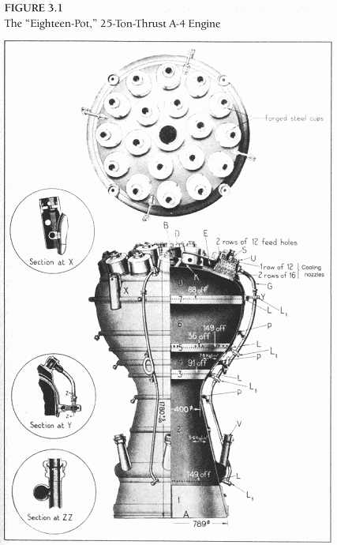

### 蒂尔与大引擎

　　1936年末，瓦尔特·蒂尔调动到火箭处，这是弹道导弹项目发展的里程碑。在数月之内，他引入科学的分析方法，重新规划了整个设计方向。这之前引擎设计一直由瓦尔特·里德尔和布劳恩负责，他们为A-3和A-5设计的1,500公斤推力引擎，在体积和效率上都有很大的跨越，但也把军械局团队带进了死胡同。基于实践经验以及布劳恩在1934年博士论文中有限的理论计算，库默斯多夫的引擎变得越来越长。这样设计的目的是让燃料和氧化剂充分雾化、混合和燃烧，但25吨推力的引擎会因此变得笨重。另外1,500公斤推力引擎的燃烧效率还有待提高，现在的喷气速度远远低于2000m/s的目标速度，这需要最充分的利用混合后的乙醇和液氧，并使燃烧室内达到十倍大气压。

　　蒂尔肤色苍白，黑发，为人热情，极具个性地戴着一副角质镜架的眼镜，很符合一个纳粹时期德国刻板科学家的样子。他忠于国家，但因为工作太投入而无暇政治。据目前掌握的资料，他从未加入纳粹。他就是德国教授的风格，在下属面前保持权威，说一不二。他总是精神紧张，在压力大的时候容易间歇性抑郁。多恩伯格和布劳恩曾不得不数次调和冲突。但是蒂尔作为化工博士加入团队，有着敏锐的理论视野、宏大的抱负，充满创造力。作为库尔特·瓦姆克的替代者，他曾是赫尔穆特·瓦尔特的同事，有着实验室内过氧化氢引擎的研发经验。在海兰特20公斤推力引擎的项目中，他指导过一个研究生，方向是燃烧的基础工艺。

　　1937年初，蒂尔的起始项目还是继续火箭推进技术所有领域的基础研究，包括使用新的液氢推进剂。他还制定了一系列野心勃勃的计划，与科研机构合作，研发更耐热的金属合金材料，更好的燃烧理论，更周密的喷气温度和成份测量手段，但是蒂尔被强制要求只能使用军械局本身在库默斯多夫和佩内明德的资源。尽管从1935-36年，布劳恩团队就与两三家科研机构合作，研究空气动力学和测量方法，但陆军对保密的要求，使得接洽的研究所数量在二战前降到了最少。军械局的目标是在最高密级下研发和制造弹道导弹，然后在战争中突然部署。德国火箭计划的任何泄露，都将破坏出其不意的效果，并且会让别国奋起直追。军械局几乎否决了所有与外界合作的研究，以将泄密的风险降到最小。

　　1937-38年间，尽管存在种种不利条件，蒂尔还是快速实现了四项创新，使一个高效的25吨推力引擎成为可能。第一项：极大地提高雾化和混合效率的注入系统。A-3引擎用的是海兰特系统的改进型，蘑菇型的喷嘴从引擎顶部倒挂下来，将酒精雾化向上喷向液氧喷嘴。多恩伯格号称他第一个建议使用小型“离心”喷嘴，可以将推进剂更充分地雾化，液滴喷出时带有角动量，提高混合效率。蒂尔迅速与离心喷嘴制造商Schlick公司合作。1937年7月，他演示了一个将离心喷嘴安装在注入系统中的1,500公斤推力引擎，喷气速度立即从1700m/s提高到了1900m/s，排气速度高意味着更好的推进剂利用效率，另外还能将空气舵的控制力提高20%。

　　第二项创新，将燃料和氧化剂的喷射孔设置在燃烧室上方的很多小舱内。1937年的实验证实，这种“预燃室（pre-chamber[^1]）系统”，可以使推进剂在燃烧前更充分地混合。另外，这项技术可以避免热损毁和烧穿，因为可以使火焰前端远离喷管。图3.1显示的是安装了18个这种小注入室的A-4引擎。

大不列颠战争办公室（British War Office）绘，1946

　　蒂尔的另外两项创新还要一段时间才能研发出来，但是从他1937年夏天周密而科学的研究项目中可以看出端倪。第一项是缩短燃烧室的长度。1937整年，蒂尔及其助手在库默斯多夫试验了大多数形状。他们还设计了小型100公斤推力的引擎，使用汽油和压缩气体以便于处理重复的测试。他很快得出结论：燃烧效率的关键在于燃烧室的体积而不是长度。1937-38年进行了进一步试验，证明可以通过增大横截面，来缩短引擎长度。改进的注入系统系统同样有助于更充分的燃烧，改善依靠相对长时间滞留燃烧室以实现充分燃烧的现状。对1,500kg引擎的测试显示，可以将燃烧室缩小为老引擎的数分之一。一个大为缩短的圆形燃烧室也减少了燃烧室过长带来的其他问题，包括压力波动以及混合不充分。1938年8月，蒂尔定型的25吨引擎，与先前的设计相比大为缩短，可以有效地简化制造和安装工作。

　　1937年夏，蒂尔意识到引擎喷管的长度和形状也需要调整，他首创了系统性的测试方法，直接导致了他的第四项创新。1931-32年间，海兰特进行的压缩空气试验显示狭长型喷管效率不高，但布劳恩团队并没有进一步研究这个问题。实践经验以及现有的喷管理论，都印证了1932年后的实际标准：喷管张角10度到12度。1938-39年,蒂尔却证明了30度张角能降低喷气和管壁间的摩擦力。喷管也应该进一步缩短，过长会导致喷管尾部的湍流。这些改进增加了排气速度，进一步缩短了引擎长度。截止1938年末，蒂尔已经基本达到2000m/s预设目标。

　　改善的注入系统、预燃室系统、球形燃烧室、张角更大的喷管，这四项创新带来的累积效应带来了革命性的突破。这些成果也说明了在持续增加的资金和人力投入下，对一个待成熟转化的技术进行系统性攻关，会取得什么样的效果。尽管蒂尔有时候难以相处，但他富有洞见的头脑，工程实践上的天赋，刻苦工作的品质，盘活了推进技术团队，并将他们推向前进。布劳恩的领导角色处于次要位置，因为他在看到蒂尔在引擎研发领域游刃有余后，将注意力转向了制导系统。但不能因此否认布劳恩的作用，他的气场和极富想象力的个性，结合卓越的管理技巧，还是进一步激励了蒂尔和他的团队不断突破火箭推进技术的前沿。

　　现阶段建造强力而相对紧凑的火箭引擎，在理论上已经具备可行性，但这并不意味着1938年已经解决了所有的工程问题。蒂尔团队主要面临两个艰巨挑战：注入系统需要放大，以供25吨推力引擎使用；冷却系统需要解决因燃烧效率提高和体积缩小造成的单位面积上热量更高的问题。

　　蒂尔需要增加17个推进剂注入系统，他采取了意料之外却情理之中的方法，先建造了一个过渡大小的引擎，安装一连串的注入舱或者“注入罐”。佩内明德的1号测试架要到1939年4月才会完工，1937-38年，蒂尔设计了推力为4.2吨的引擎，正好适合在库默斯多夫测试。这个引擎并联了3个注入系统，每个产生1.4吨的推力。实验结果表明因为燃料混合更充分，集束引擎略微提高了燃烧效率。但是从3罐4.2吨引擎，到18罐25吨引擎，这中间并不是简单的线性关系。1939年，蒂尔和助手偏爱于“星型”布局，6个或者8个大型注入罐分布在燃烧室的边上。这个配置在佩内明德经过了实际测试，但是因为冷却以及烧穿问题而失败了。1940年中期，团队集中力量重新设计了18个较小注入罐的方案，一个能工作的A-4引擎很将快成为现实，这是1939年9月二战爆发后，陆军军械局对蒂尔越来越紧迫的要求。

　　18个注入罐的设计已经定型，但引擎却一直失败。液体火箭团队在项目之初就遇到困扰：引擎燃烧越有效率，散热问题就越严重。在2400摄氏度的时候，燃烧室内气体的温度已经超过了金属外壳的熔点。再生冷却（燃料流经遍布引擎的套管）只能部分解决这个问题。改善材料也有助于解决问题，但由于保密原因，火箭团队在战前没有往这方面进展。战争开始后，铝、镁等原料严重匮乏，火箭团队不得不尽可能地使用钢材料，而且还不是最高品质的钢。这相当讽刺，为了减轻重量使用铝合金，整个三十年代团队曾付出过艰辛的努力。

　　解决烧穿问题的是另一项重要的创新：膜冷却。工程硕士莫里茨·珀尔曼（Moritz Pöhlmann），1939年刚到佩内明德担任推进设计办公室主任，几乎立即建议在燃烧室和喷管的壁上使用乙醇膜，以隔绝燃烧气体产生的大部分热量。测试在较小引擎上取得了成功。最终的设计见上图，四个环形带小孔将乙醇渗进燃烧室，大约可以带走总热量的70%，然后再生冷却系统带走剩下的30%。

　　实现这个设想绝不是简单的工作，选择注入系统的形态仅仅是开始。经过了两年不断的试错法实验，包括膜冷却系统的注入口，注入罐开口和喷管的配置， 由18个注入罐组成的引擎终于能够持续工作。测试台上的失败往往意味着壮观的摧毁引擎的烧穿和爆炸。金属疲劳也会使没用过几次的燃烧室烧穿。只有大量的原材料和人力资源，再加上佩内明德和库默斯多夫大量的制造和测试设备，才使得蒂尔团队的创新迅速变成可用的技术。

　　在负责设计25吨引擎之外，推进团队还与瓦尔特·里德尔的设计部门合作，研发一些周边设备。1938年中叶，库莫斯多夫新来的制图员建议用石墨代替A-3上使用的昂贵钼钨合金，空气舵的问题基本得到解决。蒂尔的团队也沿袭了涡轮泵的研发，以输送大容量的推进剂。1935年中期，布劳恩开始了这项研究，他与位于西南德国的Klein，Schanzlin & Becker公司合作，这家公司有大型灭火水泵的经验，但极端的温度、输送液氧时润滑困难，以及紧凑轻便的要求，研发需要数年时间。液体燃料火箭的工程要求，让涡轮泵的研发成为了技术的绝对阻碍。

　　库默斯多夫的工程师必须找到驱动涡轮泵中心涡轮的方法，从而提供能量将液氧和乙醇从燃料箱中抽出来。1936年，军械局为很多种方案申请了专利，包括了从燃烧室中引炙热气体推动涡轮扇叶的方案，但最终的解决方案来自于与赫尔穆特·瓦尔特的过氧化氢火箭的合作。1936年3月，布劳恩让瓦尔特设计了后来称为“蒸汽发生器”的东西。过氧化氢与催化剂混合后，产生的超高温的水蒸汽可以用来驱动涡轮。第一版设计来自于鱼雷系统，虽然表现低于预期，但远比从引擎中引出炙热的喷气更为实际。1937年后，用于火箭飞机的小型涡轮泵/蒸汽发生系统（来自空军的资金）为进一步研发积累了经验。军械局的第一款使用涡轮泵的火箭引擎实际上是为第二版He 112研发，其在1939-40年测试。直到1941年，在里德尔的设计部门的帮助下，蒂尔的推进团队初步完成了涡轮泵/蒸汽生成系统的设计方案，然而随之而来的是无数的研发和生产上的问题。

　　在推进技术的设计和研发中，企业只有在这些辅助装备上发挥了重要作用，其他情况下佩内明德的官方团队主导了研发进程。二战开始后，军械局开始引入大学作为第三支力量。尽管专题论文在1937年以前对于推进系统很重要，战争迫使军方放松了保密限制。战争爆发后，陆军统帅立即加速了A-4计划，这成为了事件的催化剂。为了解决这些棘手的技术问题，在1941年9月前完成部署，军械局决定在项目中大规模引入社会研究机构。1938年3月，贝克尔少将升任军械局局长，可能是他建议并实施了此项行动。

　　除了加速A-4的研发外，贝克尔促成佩内明德与大学合作还有第二层动机：保住军队在战时学术研究中的地位。在过去的几年中，贝克尔成为第三帝国科技政策的决策者。作为柏林工业大学军事技术系的系主任，贝克尔在德国科研院所军事化以及国家垄断方面发挥了重要作用。尽管这个系从未有效运作，贝克尔也将大部分的工作委托给了副主任，但他的学术地位帮助他赢得了全国声誉，提高了与纳粹高层的关系。1937年，由帝国教育部长伯恩哈德·鲁斯特（Bernhard Rust）提名，他当选为新成立的帝国研究委员会（Reich Research Council）主席。和纳粹政权的大部分领导人一样。贝克尔的很多头衔造成了很有权势的假象。研究委员会根本无法运作，由于各部以及各军种间的竞争，帝国无法达成一个连贯的科技政策，当然也因为鲁斯特在第三帝国各种幕后的残酷政治斗争中根本无足轻重。

　　1939年，战争毫无征兆地爆发，德国教育和研究政策被混乱笼罩。并没有科学和工程学的动员计划，而大量的征召入伍使研究机构缺乏学生和年轻学者。甚至有人提议战时暂时关闭大学。不论从爱国还是私人角度，研究机构的领导人们热切希望获得军方项目以得到资金以及征召的豁免权。而为了自己的利益各军种也尽量抢夺研究所，不仅是因为战争需要更多的研发能力，也避免让别的军种或者个人获得他们想要的研究所。这是出于第三帝国这个竞争官僚帝国联合体的本能。30年代末，希特勒没有提供有效的军种间合作机制，也没有明确重整军备的优先权，这加剧了军种间的竞争。1939年9月，贝克尔不得不加快稳固陆军学术地位的步伐，但通过帝国研究委员会显然无法完成这个任务。尽管是名义上的主席，贝克尔局长自己也很少利用这个机构，同月，陆军从委员会手中夺得了核武器项目，舒曼的研究部负责督办。1938年末，德国物理学家发现了铀裂变的现象，从此德国人开始调查核武器和反应堆的可能性。

　　在贝克尔的支持下，多恩伯格的火箭处（Wa Prüf 11）立即开始与各学术机构尤其是各工科大学建立联系。9月14日，这是目前可考的第一次会面发生时间，地点位于德累斯顿工业大学。两周后，多恩伯格、蒂尔和瓦尔特·里德尔在库默斯多夫主持会议，议题是推进技术研究，共有四所大学参加。就在那几天，或者稍后几天，36名教授访问了佩内明德。这个场合迅速获得了一个讽刺性的昵称“智慧日”，这一天如此之多聪明的头脑齐聚佩内明德。火箭团队与大学建立联系，这一天成为了佩内明德的传说。但除了已经获准参与项目的人员外，这些学者并没有获准进入极端秘密的研究中心，只有诸如哪家研究所参与哪个项目，这样的细节等待确认。

　　在与研究机构建立联盟的过程中，多恩伯格遵照贝克尔的意思，完全绕过了研究委员会，即使教育部长也被绕开了，9月19日，多恩伯格只是告诉了作为联络人的舒曼，让他通知鲁斯特的教育部，有一些科研机构将为陆军服务，并且还会有更多的研究机构加入。火箭处的处长为越权找了这样坦诚的理由：“必须加速执行协议，因为目前相关的人员没有被征招，他们将会[合同性地]有义务属于RLM[航空部]。”更不用说陆军火箭研发某些领域还与空军联系密切，军种间的关系被继续侵蚀，对于德国的战争努力来说这不是个好兆头。在这种情况下，向军事功能存疑的A-4项目投入如此巨大的资源也不是一个特别好的信号。

　　将大学研究机构引入火箭项目，为了国家的说法稍有勉强，但11处的技术研发肯定从中得利，包括蒂尔推进技术的研发。在25吨引擎的设计摘要还没有被学术研究改变的时候，斯图加特工业大学的韦威尔卡（Wewerka）教授给出了重要建议，克服了涡轮泵的设计问题。韦威尔卡从理论上验证了蒂尔关于喷嘴的张角理论是最优的。另选一个重要的例子，德累斯顿工业大学（后来的柏林工业大学）的贝克（Beck）教授，帮助提出并测试了A-4的改进版注入系统。18罐引擎已经能够工作，但显然需要重新设计，引擎“迷宫一般，是管线人员的噩梦”，这句话引用自蒂尔的继任者马丁·席林（Martin Schilling）。引擎需要18条独立的液氧管线，燃料管线同样复杂，需要构成冷却套管，安排膜冷却出口。1940年8月，推进团队全部搬到佩内明德后，库默斯多夫的一个测试架完全划归Beck的研究机构使用。改进后的注入系统被称为“混合喷管”，使用了一系列的同心环槽或者说密布注入孔的碟状设备，但期望中的快速成功并未实现。

　　充满活力和想象力的蒂尔也在寻求改变25吨引擎的基本设计。从1937年开始，他一直尝试提高燃烧室压力，让燃烧更有效率。他为He 176火箭飞机研发25个大气压，725公斤推力的引擎，但当时的技术水平无法保证项目完成，最终他将A-4引擎燃烧室压力提高到13个大气压，这样不用对原始设计做很大改变。1941年，他尝试寻找新推进剂，因为液氧很难处理并且还遭遇供应短缺。1941年9月15日，蒂尔正式宣布A-4研发已经结束，但A-4离量产其实还有很大的距离。尽管如此，在加入多恩伯格火箭处的五年中，他在火箭技术领域取得了革命性成就。现在德国有能力将一个起飞重量超过12吨的导弹发射到数百公里外，这是一项非常了不起的成就。

[^1]: prechamber是预燃室，然而这里的原文是pre-chamber，暂理解为预燃室。