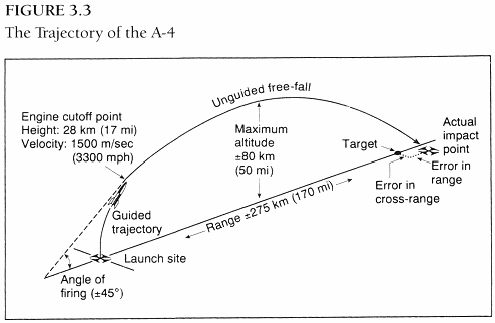

### 布劳恩，施泰因霍夫与导弹制导

　　与其他两项关键技术不同，制导系统研发方向的转变，并没有在1936-37年之交开始，Kreiselgeräte一直是军械局在这个领域的唯一合同商。1937年12月，A-3发射失败，局面才有所改观。这次失败大大加速了团队在理念上的双重转变：在陀螺仪和自动驾驶领域引入竞争公司，培养佩内明德自己的专家。尽管这两个措施已经在同时进行，但1939年，因为对公司越来越不满意，布劳恩开始认真组建大型制导实验室。导弹制导系统的要求较为极端且非常专业，军械局要求快速出成果的压力也相当大，合同商们同时还承接着空军和海军的项目，他们的研发能力已经严重超负荷。布劳恩拒绝接受项目延期，他用快速增长的预算在佩内明德建设新的实验室。

　　1937年11月9日，布劳恩和多恩伯格参加了电子行业巨头西门子的航空设备部召开的会议，为Kreiselgeräte公司引入竞争机制由此正式提上日程。西门子的卡尔·菲贝尔（Karl Fieber）博士参会，他后来回忆这次会议：“不同寻常的以死刑相威胁的保密声明”。一同参会的还有西门子航空设备部总监卡尔·奥托·阿尔特瓦特（Karl Otto Altvater），以及克劳斯·里德尔，他在火箭发射场团队解散以后已经为西门子工作了三到四年。阿尔特瓦特是里德尔的叔叔，是退役的U艇船长，二十年代在海军军械局任处长。在业余火箭团队解散后，他帮侄子以及两个三个火箭爱好者在西门子安排了工作。1937年7月，在拿到内贝尔-里德尔专利后，克劳斯·里德尔带着朋友加入了佩内明德。大概率是里德尔的建议，在陀螺仪研发领域引入西门子，作为竞争力量。从二十年代开始，西门子逐渐深入飞机自动驾驶和航海设备研发。1931年，西门子购买了Boykow在这个领域的专利。

　　在11月9日的会议中，布劳恩讲解了A-3现有的制导系统，并没有暗示火箭团队缺乏信心，西门子的人没有发表评论。不过多恩伯格暗示军械局“有清醒的意图……为Kreiselgeräte找一个竞争对手”。讨论结束后并没有立即采取行动，这之后的两个月，多恩伯格团队全力投入格赖夫斯瓦尔德之岛的发射以及失败原因的分析。直到1938年1月底，才有机会针对这个议题开会。这次会议的风向完全转变，通过对A-3试射的事后分析，西门子认为Sg 33的控制力不足，无法阻止箭体快速旋转。

　　同时，火箭团队与Kreiselgeräte的讨论也产生了一些基本的决议：引入系统性的发射测试，增强空气舵的控制力，改善新火箭的气动稳定性。Kreiselgeräte必须大幅简化控制系统，剩余部分需要再精细化。公司继续遵循Boykow的基本理念，也是大多数惯性制导系统的基本原理：不管火箭如何运动，稳定平台在空间中保持不动。稳定平台为火箭位置和加速度的测量提供基准。但是对A-5，为旋转轴方向增加第三个陀螺势在必行，Sg 33出于简化的原因忽略了这个陀螺。为了降低复杂性，佩内明德和Kreiselgeräte决定放弃喷射氮气来稳定平台的做法，发射后停止给陀螺仪供电。A-5将采用重型陀螺，其自身就可以使平台保持稳定，但在引擎点火的45秒中，陀螺的的响应速度会因摩擦力而降低。这个方法显然是权宜之计，满足不了A-4日益增加的需求。

　　被取消的还有用来测量偏离轨道的水平位移的小型加速计。A-5的制导系统，代号Sg 52，集中着眼于解决维持火箭飞行的合适高度问题。为了获得更精准的控制，保持更高的稳定性，需要更多的输入信号使火箭保持预定轨道，避免偏航、倾斜和旋转。与A-3相比，Sg 52稳定平台上的陀螺，反馈信号是箭体相对于平台的高度，还需要反馈控制喷气方向的空气舵的位置。这些信号与其他三个速率陀螺的信号混在一起，这些速率陀螺用来感应火箭的转动（速率），并未安装在平台上。混合的输入信号，通过机械系统的旋转杆和齿轮，最终控制空气舵。

　　在1938年1月中旬以前，团队很快速地做出以上关于新的Kreiselgeräte系统的大部分决策。多恩伯格和布劳恩花费了长得多的时间，与西门子合作开创一个竞争项目：新A-5系统。阿尔特瓦特团队的强项在于自动驾驶系统，飞机可以保持在设定高度按照特定航向巡航。在这种类型的设备中，“方向陀螺”用来保持航向。在某些版本中，使用一至两个其他陀螺仪，与速率陀螺仪配合保持稳定，避免飞机沿长轴转动或者飞机头部上下摇晃。这些自动驾驶系统没有稳定平台，西门子很自然地尝试将位置陀螺仪固定于箭体之上。系统的固有精确性比平台差，因为箭体在一根轴上的移动会改变其他轴的朝向。只有在引擎工作的有效制导时间较短的情况下，如A-5的工作时间少于45秒，控制系统才能有效限制导弹运动，让误差在可接受范围以内。虽然固定方案的缺陷明显，但好处在于使设计大为简化。

　　尽管与自动驾驶系统很相似，但是让这个系统能够在火箭上工作，而且不仅仅是A-5，首要的是为了A-4，阿尔特瓦特团队几乎还是白手起家。与自动驾驶不同，导弹制导系统的工作范围必须很广：速度从0到5400km/h，高度从起飞到引擎停机时的30公里。作用于箭体的外部气动力一直在变化，同样因为燃料箱渐渐变空，火箭的中心和惯性力矩也一直在变化。但在1938年，对于设计A-4系统所需的这些关键技术，团队所知甚少。而伴随发射的强烈震动和巨大加速度，也对设备的可工作环境提出了苛刻要求。

　　卡尔•菲贝尔是阿尔特瓦特的核心下属，为了应对这些困难的需求，他提出了一种新系统，只需要使用两个特制类型的位置陀螺。这一设想后来成为A-4制导系统的基本原则，因此算作火箭领域的又一项重大创新。第一个陀螺被称作“地平线”，与飞机的人造水平陀螺同名，负责火箭的俯仰轴。另一个陀螺，被菲贝尔称作“垂直线”（Vertikant），负责偏航轴和滚动轴（与“地平线”类似，这是一个二自由度的陀螺仪，可以在两个轴上自由移动）。西门子最终将整个系统命名为“垂直线制导系统”。根据菲贝尔回忆，他在1938年末申请了专利。但获得专利以后，因为保密原因，他甚至没有拿到证书的复制件。

　　在菲贝尔的系统中，除了测量箭体在俯仰轴的高度，“地平线”还用来发送信号，使火箭从垂直方向渐渐向45度倾斜。简易弹道导弹的弹道制导过程与火炮炮管的作用相当。炮弹在离开炮管的时候，会获得一个特定的速度以及特定的角度，这与引擎停止工作时，火箭的状态完全类似，然后都是在重力的作用下飞向目标。对于抛射体来说，初始速度和仰角决定了抛射距离。贝克尔和军械局火箭支持者从一开始就认识到，不用炮管约束的代价就是需要复杂的制导和稳定机制来控制火箭。这些机制也需要有调节火箭俯仰的能力，因为液体燃料火箭不像战术固体火箭一样可以以某个角度从轨道上发射。采用液体引擎的火箭必须垂直发射，因为初始加速度很低，如果按照某一角度发射，气动力过小无法抗衡重力和风力，也无法稳定箭体。

 

　　当Boykow加入项目的时候，他规划了执行逐渐改变仰角的机制。在一段时间的垂直上升后，导弹将迅速转成45度仰角，并严格保持在另一条直轨道上。在A-3发射失败后，火箭团队和Kreiselgeräte立即意识到：如果使用这种策略，控制系统将无法提供所需的控制力，因为Sg 33的控制力甚至无法改变火箭的垂直轨道。佩内明德随即于1938年初，与制导系统的两个合同商进行了讨论，布劳恩和助手接受了采用渐进式转向机制的必要性，这个机制将至少应用在A-5上。

　　问题变成了如何落实此机制。菲贝尔的专利无法拿到，所以他的提议目前不可知，但不久团队就找到了解决方法，可以用在所有固定式火箭控制系统上。通过使用一个发条机制，可以使俯仰陀螺的传感器缓慢旋转，传感器就会被欺骗，认为火箭正在朝预定弹道的相反方向倾斜，陀螺就会发出纠偏信号，控制系统将火箭头部慢慢转向。Kreiselgeräte的Sg 52稳定平台及后续系统，使用了更复杂的机制转动平台的俯仰，以达到相同的效果。

　　菲贝尔的“垂直线”制导系统非常有想象力，在融合了执行俯仰策略的简单机制后，成为了Kreiselgeräte平台的有力挑战者。但实际上，西门子无法研发出这种系统。公司的一名经理，可能就是阿尔特瓦特本人，称之为“吹牛工程”。他质疑整个项目，因为火箭粗糙的研发环境、菲贝尔陀螺的特性以及军械局要求一年内完成A-5的要求，最后一项也体现了陆军对于弹道导弹紧迫性的认知。另外航空设备部的研发能力受制于为空军服务，因此西门子内部也有反对的声音。面对为陆军制造数十套系统的抵触情绪，布劳恩决定使用孤注一掷的菲贝尔提出的“近乎荒谬”的提议。布劳恩在会议中宣称，A-5上将使用三个普通航空用“方向陀螺”来指示火箭的位置，尽管这些陀螺缺乏精度而且通常不在这么高的加速度下使用。菲贝尔反应激烈，但是布劳恩拍着他的肩膀说：“但是，菲贝尔博士，大胆地说出来就已经成功了一半。”这是典型的布劳恩式的大胆解决困境的方式。

　　目前无法确定会议的准确日期，但1938年秋天，西门子制订了代号D 13的A-5制导系统的计划。系统使用3个方向陀螺定位，3个速率陀螺保持稳定，所有陀螺都直接连在了火箭箭体上。1938年8月，佩内明德和西门子也确定了空气舵的命令传输模块的布局。在西门子的自动驾驶系统上，已经使用了液压伺服马达来移动飞机的控制翼面。系统将电信号转成液压活塞的油压变量，产生的机械能可以使空气舵转向。液压伺服系统实际上已经成为了A-4的关键技术。

　　截至1938年末，佩内明德已经有两套不同公司研发的制导系统，并且如果有更高精度、更好性能的陀螺仪出现，菲贝尔的实现在未来可能成为第三种选择。但是当时的实际情况并不乐观。Kreiselgeräte和西门子的进度都一而再再而三的推迟。1938年初，西门子曾暗示他们的系统最迟会在1939年3月完成，这对多恩伯格来说已经很晚了，但实际上直到1940年4月，装备了D 13的A-5才进行了试射。1938年10月，Kreiselgeräte承诺Sg 52可以在1939年7月完成，布劳恩在信的空白处写道：“开始承诺是2月，然后4月，现在是7月！”愈演愈烈的军备建设也部分造成了困难，火箭项目对两家公司来说都不是主业，Kreiselgeräte几乎全力为海军工作，西门子航空设备部则完全与空军绑在一起。在这种环境下，全力解决制导系统问题的布劳恩，在寻求更进一步的灵感以及企业合同商。

　　1938年11月末，布劳恩发现了空军的另一个独立研发的自动驾驶系统。这个项目由德国北部的雷希林（Rechlin）空气力学测试中心负责，主任是工程硕士瓦尔德马·默勒（Waldemar Möller）。默勒即将被调动到Askania精密设备公司，以便自动驾驶系统从实验室走向产业化。在得到航空部的批准后，布劳恩联系了Askania。此公司却推荐了他们的简易海军鱼雷系统，系统只使用位置陀螺和压缩空气，来传输控制命令。佩内明德立即解释，鱼雷系统需要大量改进才能使用，因为空气带来的震荡远小于相对稠密的水。进一步的调查显示，气动控制远逊于西门子的液压系统。最终这个项目完全是浪费时间，在战争初期就被放弃了。

　　1939年4月，马不停蹄的布劳恩对雷希林的自动驾驶系统重拾兴趣。系统使用了特种速率陀螺，控制部分使用了功放和电动机。因为Askania公司在年末才实际主导这个项目，只有向默勒本人咨询，对佩内明德才稍有帮助。第三种制导系统的重要之处在于，对佩内明德自己的研发能力有进一步的帮助，“雷希林制导系统”里都是自己人。不管怎样，布劳恩不得不同时掌握三到四个并行的制导系统研发。有很多的理论和技术问题，合同商根本没注意或者没时间注意。

　　这些问题导致了超困难的稳定方程式，是否能够求解关系到A-4的成功与否。在A-5的基本布局设计结束以后，1939年1月，团队开始了A-4的实际设计。但这项工程与气动问题一样，有太多的问题需要解决。1937年，火箭团队请来了天才的数学家保罗·施罗德（Paul Schröder）博士进行相关计算。但不久，布劳恩对他很失望，施罗德宣称某些制导问题无解，这不是布劳恩能够容忍的态度，布劳恩需要聪明、乐观和刻苦工作的精神。施罗德靠边站，取而代之的是能力很强的赫尔曼·施托伊宾（Hermann Steuding）博士。施托伊宾来自达姆施塔特工业大学（Technical University of Darmstadt），在气动力团队的配合下，他的团队在制导系统的基础理论方面作出了杰出贡献。

　　施托伊宾推荐了他大学的朋友恩斯特·施泰因霍夫（Ernst Steinhoff），担任布劳恩新建的制导控制部的负责人。1939年7月1日，施泰因霍夫开始为佩内明德工作。只有31岁的他，成就惹人注目，他保持着滑翔伞飞行距离的世界纪录，并且因飞行成就得到了空军“飞行上尉”的荣誉军衔。他曾深入参与了航空部的滑翔飞行研究基地的工作，基地位于达姆施塔特附近，他于1940年完成了关于航空设备的博士论文。1937年5月，他加入纳粹，承认纳粹的理念很“理想”。布劳恩回忆说，施泰因霍夫的任务是招募一名成员并至少花费100万马克组建实验室。除了制导系统外，他还负责板载电子设备以及管理Gerhard Reisig的测量团队。施泰因霍夫比蒂尔和赫尔曼稍稍逊色，对A-4的基础创新贡献甚少，但Kreiselgeräte的工程师弗里茨·穆勒（Fritz Müller）曾说过：他是一名优秀的管理者以及一个“巨大的推动者”。同时布劳恩继续在制导项目上扮演关键角色，除了锻炼各领域都用得着的管理天赋，比如他有掌握一个复杂会议上的讨论方向的能力，能够准确抓住重点，他也能激发制导团队的灵感，用他富有感召力的个性以及不停地发问。

　　布劳恩组建了施泰因霍夫的新部门，带来的效应之一就是加强了“一个屋檐下解决所有问题”的趋势，使厂商退居二线。这个领域的新进人员也对佩内明德日益增加的科研气氛做出了贡献。来自于各个工科大学，受过学术训练的工程师们，越来越多地占据了领导岗位。在许多情况上，夺走了现在已占少数的火箭团队早期成员的光彩，这些人中的大部分都在蒂尔手下工作。中心的技术领导岗位开始由一群差不多的年轻硕士或者博士执掌，大部分都在1904年到1914年之间出生。（气动学家们是唯一靠训练出来的科学家，布劳恩拿到了物理学博士，但实际上他仍然是一名工程师。）

　　战争只是提高了学术型工程师的优势地位，征召平民以及加速A-4研发的压力，使更多的专业人士来到佩内明德。1939年秋，保密限制放松后，通过大学研究所建立起来的私人关系，成为招募人员的决定性因素（不取决于政治联系）。这也是施泰因霍夫部门内来自达姆施塔特工业大学的人越来越多的原因。达姆施塔特也占据了大部分佩内明德的大学研究合同。截至1940年1月，共有238名人员为佩内明德的合同工作，其中92人来自达姆施塔特；排在第二位的是德累斯顿工业大学（Technical University of Dresden）和柏林震动研究所（Institute for Oscillation Research），都是45人。

　　制导系统比另外两个关键技术加起来占用的大学研究人员还多，这种科研模式也反应了，在1939年9月佩内明德为了一枚可制导的A-4，所需要解决问题的数量。确定了陀螺仪和控制系统的基本配置，这才解决了一半的问题。更多附加的无线电设备还未研发，手动停止A-5引擎以及弹出降落伞急需这些设备。A-4的射程以及找回A-4的困难，意味着佩内明德不得不使用遥测系统，将测量结果发送至地面，以避免像A-5那样使用摄影机，记录下来的画面闪烁振动。还需要一个无线电追踪系统，记录A-4离开视野后的速度和位置。大学研究所，特别是柏林和德累斯顿的研究所，在这项工作上作出了贡献。这中间特别重要的是由德累斯顿的沃尔曼（Wolman）教授开发的追踪系统。最终版本中，系统使用了地面发射信号，A-4中继回传的方法测量导弹的速度；多个基地进行三角定位测定轨道。（就像汽笛一样，迎面过来音高会变高，离开的方向会变低，随着多普勒效应，火箭信号的频率在方向和强度上改变，可以用来测定速度。）

　　大学的制导研究也正好关注相关的问题：如何在合适的时间关闭A-4的引擎，让火箭的射程正好命中目标。Boykow曾想使用某种类型的积分加速计，加速计是对导弹的即时加速度进行积分从而测量速度的设备。这项技术的根本问题在于，测量加速度的微小误差会随着叠加呈指数级增加。1939年7月，Kreiselgeräte基于这个设想重新开始研究，提出悬空的陀螺仪可以作为加速计。在弗里茨·穆勒的领导下，这种机制发展成为决定引擎关闭的主要手段，但在1939年秋，这个项目离成功还相当远。

　　战争开始后，随着越来越多的大学研究者的加入，布劳恩和施泰因霍夫启动了几个相互竞争的项目。达姆施塔特的两个研究所开始研发基于其他物理定律的加速计。1940-1941年，德累斯顿的沃尔曼改进了他的追踪系统，提出另一种无线电方法。在发射场后部署发射/接受器，并与发射方向保持一致，可以用来判断导弹的速度，并在合适的时机发送信号使引擎停止工作。地面发射信号，导弹将信号频率加倍然后回传，地面设备分析原信号和处理过的信号，当A-4达到指定速度时，自动发送停机指令。沃尔曼的无线电和穆勒的加速计方式都成为了A-4的引擎停机系统，因此都是A-4成功的基本创新。

　　A-4成功的最终一块拼图，也来自于佩内明德蓬勃发展的电子和无线电技术。在施泰因霍夫加入后不久，他决定精确测定风速的影响，吹过弹道的风会影响导弹，造成横向偏移。计划中的制导系统将成功稳定导弹并执行纠偏程序，但是系统无法探测预定轨道水平方向上的横移。在1939年9月1日德国闪击波兰前后，施泰因霍夫与航空部的人会面，他们同意合作改善空军用于航行以及投弹的制导光束。在A-4的精确性之外，佩内明德也在思考采用滑翔作为下降方式的导弹的制导难题，这种导弹后来称为A-9。9月和10月，多恩伯格特别提到需要为A-9完善制导光束，有充分理由让空军提供测试飞机。空军最终租给了佩内明德东三架飞机。

　　施泰因霍夫与航空部同僚达成的协议其实意义并不大，因为无论空军还是企业，在战时都没有足够的力量负担起这一整项工作。施泰因霍夫需要在他蓬勃发展的实验室中建光制导部门，他建设这个部门的方式很好的诠释了私人关系在战时招募中的作用。赫尔穆特·赫尔策（Helmut Hoelzer）是一个在柏林Telefunken电子公司工作的电子工程师，1939年10月的某晚，他听到有敲窗户的声音。窗外是他达姆施塔特开始就认识施泰因霍夫和施托伊宾，还有一个年轻点的男人。赫尔策被邀至酒吧，这个第三个人，“一直在吹口哨”，踩着音乐的节奏，看着姑娘，问赫尔策神秘的问题：如何才能制导一个飞行的物体，但并不描述是哪种物体，赫尔策说他无法回答。两周内他接到了佩内明德东的征召通知，他对这个地方一无所知，但遇到的第一个人就是当时的那个年轻人：佩内明德东的技术负责人，27岁的冯·布劳恩，赫尔策随即被安排研发光束制导。

　　基于Lorenz电子公司的盲降系统,赫尔策团队研发出了最终的产品。在发射场后10到12公里处安装一台发射机，部署两个相距不远的天线，信号从两个天线中交替发出。从接收信号的强度和特征中，导弹能够判断出相对预定轨道偏左还是偏右，然后进行纠偏（技术上讲，这是一个平面制导系统，不是光束制导，因为无法控制导弹高于或低于预定轨道的情况，只能控制偏左或偏右）。尽管这种光束制导在原理上很简单，但实际上的复杂性还是可以想象的。当修正相对于制导平面的偏移时，这种简单动作会影响导弹的稳定性。当导弹回归光束的中心时，修正信号归零，但导弹还有偏向一边的动量。然后导弹会向另一个方向做出新的修正，结果就是每次纠偏之后情况会变得愈发糟糕。因此，赫尔策需要研发一种电子“混合装置”来进行额外的数学计算，以修正光束制导信号。

　　1940年末，赫尔策与助手Otto Hirschler，成功研发出这样的设备，并在波罗的海与德军占领下的丹麦Bomholm岛间进行了飞行测试。施泰因霍夫数次亲自驾机。即使取得了这样的经验，优化出一个稳定工作的系统用于A-5，还是相当困难。直到1941年春，团队才开始尝试第一次发射。在解决了A-5和A-4发射遇到的无数问题后，光束制导后来被用在了V武器战役中。

　　赫尔策真正重要的工作体现在别处。直到1941年中叶，A-5的反复发射显示了三种控制系统都可以获得稳定的飞行效果：Kreiselgeräte、西门子和Askania/默勒。但是将系统放大用到A-4上后，发现了新的问题：随着导弹体积的剧增，气动力也会剧增，对控制系统中空气舵伺服马达的要求就会越高。Kreiselgeräte复杂的电子马达和齿轮系统无法满足要求，默勒的电子马达逊于西门子的液压系统，但即使液压系统也不稳定。1941年进行的第一次A-4稳定测试显示，现有系统的稳定性确实存在问题，解决问题还需要更多的研发时间和资金。

　　在这个关键时刻，赫尔策的“混合装置”提供了解决之道。将原设计改成从位置陀螺中获取信号，就可以弃用所有的速率陀螺，而导弹仍然保持稳定。这项关键的创新可行的原因在于，赫尔策在研发制导光束“混合装置”时，不得不设计电路来完成加、积分和微分等数学运算。对陀螺的位置信号进行积分，即计算信号如何随着时间变化，能够确定导弹在各轴上的运动速度，因此可以弃用速率陀螺。拥有了这种智能机器的计算能力，其他的稳定参数可以更容易地引入到发送给空气舵伺服马达的修正信号之中。进一步来说，不同信号的比率能够随着引擎的工作而改变，以补偿气动力和导弹参数的改变。1941年，A-4的量产要求已经很紧迫，而最终弃用昂贵的速率陀螺仪，给量产潜在地省下了一大笔资金，但代价是需要更多的电子元器件，特别是真空管，而战时的德国经济中这些物资相当短缺。

　　在赫尔策的“混合装置”基础上，只需要研发电路，再实现几个数学运算就可以完成一项天才发明：世界上第一台全电子模拟计算机。1942年初，赫尔策团队在制导控制实验室造出这样一台计算机，用来计算和模拟A-4弹道。普通人特别是妇女用台式机械计算器数周的工作量，这台计算机在几分钟内就能完成。为了克服弹道导弹制导中的棘手问题，佩内明德主导下的仿真技术复杂度与日俱增，赫尔策的计算机正是强有力的工具。“混合装置”在火箭控制系统中的应用，而不是计算机仿真或者制导光束，才是赫尔策团队研发的关键性创新。没有这项技术，A-4将需要更长的时间才能研发出来，而且很难实现量产。

　　1941年末，随着“混合装置”解决方案的提出，完成真正实用的制导导弹的最后一块拼图就位。当然，施泰因霍夫的部门没有一个完整且可以工作的制导系统。A-5飞行以及仿真技术的局限，还留有很多未知的问题。一个可行系统的设计只是渐渐成型。1939年10月，Kreiselgeräte的Sg 52发射成功，这是第一次成功的有制导飞行；1940年4月，西门子和Askania/默勒系统也开始发射，这说明团队拥有至少两套可行的陀螺布局方案。Kreiselgeräte的平台方案胜在固有的精确度，但是相对而言太复杂和昂贵，这家公司也缺乏量产为A-4研发的更先进版本（Sg 66）的能力。次优方案是菲贝尔使用两个固定在弹体上的位置陀螺的“垂直线制导系统”，因为其使用的昂贵组件最少。垂直线系统和西门子、Askania的设备都在A-5上进行了手段有限的测试。这些试射也展示了液压伺服马达优于默勒的电动机。

　　西门子无法获得充足的人手，造成了生产的延期，这也使阿尔特瓦特的部门和佩内明德之间产生了裂痕。因为帝国有权使用菲贝尔的专利，火箭团队转而联手Askania和老牌陀螺仪公司Anschuetz，研究适宜的陀螺仪和空气舵马达。作为军械局设施快速扩张的另一项影响，施泰因霍夫部门快速发展的自主研发能力，允许佩内明德自己主导研究，并将三家公司的成果因地制宜地混用在A-5和A-4中。西门子并没有成为垂直线系统的研发者，只是另一家合同商。
***
　　因此，在1942年A-4试射前夕，施泰因霍夫的制导控制实验室并没有完成最后的系统。当然，如果说发射一定会成功，那肯定是在吹牛。但是成功的要素已经具备：两个陀螺方案二选一、“混合装置”、液压伺服马达、无线电或加速计引擎停车装置，也许还得加上制导光束。想想四年以前吧，就在A-3发射失败后，火箭团队离一个远程制导导弹有多远。这是一项惊人的成就！与18个小舱室25吨推力的引擎和改良的气动设计一起，火箭制导系统的成功奠定了火箭技术革命的基石。

　　为什么能在短短五年间取得这样的成就？首先是1936年以前，布劳恩团队打下了坚实的基础，然后是他的领导才能，他睿智、优雅的气质所施加的强力影响。1939年战争爆发以后，保密限制的松动，使大学的研发力量也成为另一个重要因素。但关键因素还是帝国巨大的投入以及多恩伯格“一个屋檐下解决所有问题”的理念。军械局曾尝试与企业合作解决问题，就像制导和控制系统那样，但企业缺乏资质、兴趣和研发能力，迫使火箭项目雇佣更多的专家加入团队。有天赋的工程师在佩内明德聚集，在布劳恩、蒂尔、赫尔曼还有其他人激励性的领导下，各种思想得到了充分的碰撞。当然，仅有睿智的思想还不够，资金、材料和人力也是将关键创新变成实际应用的要素，这也导致了佩内明德大量的设施和人员方面的支出。这些数目的投资自然促使了研发的大大加速，而“一个屋檐下解决所有问题”的理念也省去了可能的繁冗公文往来和联系造成的延迟。大量的测试和试验可以关起门来快速完成。

　　从五年内获得的技术突破来看，多恩伯格的组织哲学让研发资源的使用非常有效率。但是不管如何管理这些资源，在这么短的时间内为弹道火箭技术打下基础需要帝国巨大的投资，而如果没有在陆军内的高优先级以及纳粹高层的支持，这是不可能做到的。为了理解佩内明德技术成就的政治和财政基础，也为了为下文中火箭项目的冲突搭设舞台，我们必须回到1937-38年，那是火箭项目争夺优先权的战斗开始的年代。
