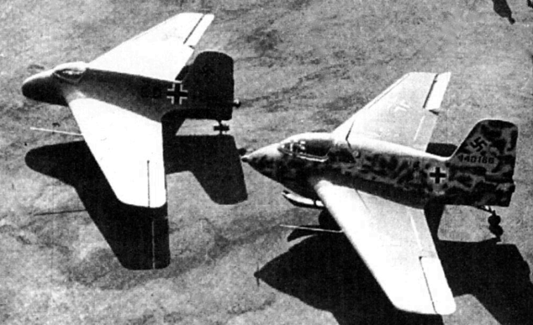

### 空军的火箭引擎

> *自从联盟和部落并肩作战，共同抵抗燃烧军团的入侵，已经过去了四年。尽管成功地挽救了艾泽拉斯大陆，部落和联盟之间脆弱的协议却早已荡然无存。如今，震天的战鼓再一次响起。*

> *《佩内明德之空军独立宣言》*

　　纳粹空军在佩内明德上投入了巨量的资源，其出发点是里希特霍芬高速截击机的设想，当时陆军A-2引擎已经研发成功，与陆军合作是很自然的事情。当然，面对陆军谋求垄断火箭技术的野心，空军作为一个有抱负有能力的军种，肯定不会甘心就范。与陆军的竞争无时无刻不在进行，最直接最能威胁陆军V-2的项目是代号樱桃石的V-1，从研发到量产，优先权的争夺从未停止。间接的则是本来与陆军合作的火箭飞机项目，陆空联盟破裂后，空军撇开了陆军单干，这其中的关键人物就是赫尔穆特•瓦尔特（1900-1980）。

　　瓦尔特主要从事过氧化氢火箭引擎的研发，过氧化氢引擎在推力和性能上都远远落后V-2的乙醇/液氧引擎，但过氧化氢引擎的适用范围远远大于重型的v-2引擎，下图是瓦尔特509A-2引擎设计图，此款引擎为“热引擎”，即双推进剂过氧化氢+碳氢燃料的组合，图中的[T-STOFF](https://en.wikipedia.org/wiki/T-Stoff)即过氧化氢，[C-STOFF](https://en.wikipedia.org/wiki/C-Stoff)即碳氢燃料，驱动涡轮泵的蒸汽发生器，也采用过氧化氢作为能量来源。右上方的飞行员阀门可以控制燃烧室的推进剂进入量，从而控制推力，图中这款引擎的推力范围150-1,700kg。*[来源](http://www.walterwerke.co.uk/walter/me163b5.htm)*

瓦尔特引擎最终装备于著名的梅塞施米特Me 163系列火箭飞机。下图前者为Me 163A原型机，后者为Me 163B量产型。Me 163采用了三角翼和无尾翼的设计，称之为火箭滑翔机更为合适。Me 163的战绩和飞行员体验都相当糟糕，但它是世界首款实战喷气式战机。

瓦尔特引擎直到德国战败前，一直处于高速发展当中。下表为其系列型号参数，[来源](http://www.walterwerke.co.uk/walter/motors.htm)。

| 型号   |  	推力   |  	装备   |  	重量   |  	备注   |
| ----   |  ----    |  	-------   |  -------   |  	------- |
| RII.203 |150-750 kg  |  	Me. 163A      |  -     |   冷引擎|
| 109-509.A-0  | 150-1500 kg  |Me. 163B  | 170 kg |   热引擎原型,1943年首飞|
| 109-509.A-1  | 150-1500 kg  |Me. 163B  | 170 kg |   最早量产的热引擎，电启动|
| 109-509.A-2  | 150-1700 kg  |Me. 163B  | 160 kg |   A-1发展型，T-STOFF启动|
| 109-509.B  | 150-1700+ 100-300 kg  |Me. 163B  | 201 kg |   A-1，额外的巡航燃烧室，只生产了十台|
| 109-509.C  | 150-2000 + 100-400 kg |Me. 263  | 180 kg  kg |   A-2，额外的巡航燃烧室，主燃烧室达到24个大气压|
| 109-509.D  | 150-1700 kg  |DFS Sagefisch   | 170 kg |A-2,引擎拆分成三大部分安装   |
| 109-509.A-2E  | 150-1700 kg  |Ba. Natter    | 160 kg | 引擎部件重新布局，适应垂直发射  |
| 109-509.S-1   | 150-1700 kg  |Me. 262  | 160 kg |   A-2发展型 |
| 109-509.S-2   | Max. 2000 kg |Me. 262  | 140 kg |   - |

